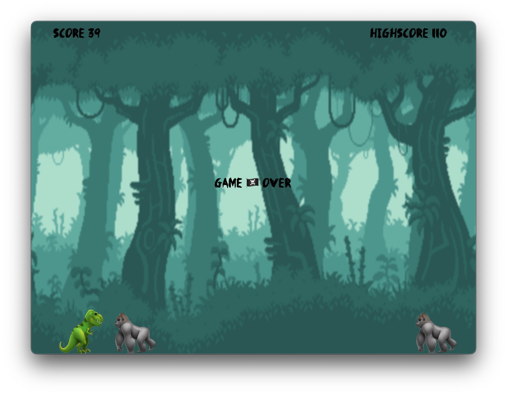

  <h1>
     
    🦖 + 🪶
     
     
    Dino - The Game LITE™ 
     
     
  </h1>
  
     
   This is the LITE version of Dino based on p5 and electron-frameworkless</em>
     
     
    
   
   
  
   

 

## 🦣 Features

- Based on [p5](https://p5js.org).
- Based on [electron-frameworkless](https://github.com/morellexf26/electron-frameworkless).
- Lighter version.
- Better quality.

 

## 🦧 Build

1. `npm run app:dir`
2. Look at `dist/` folder.

## 🦘 Run

1. `npm install`
2. `npm run start`
